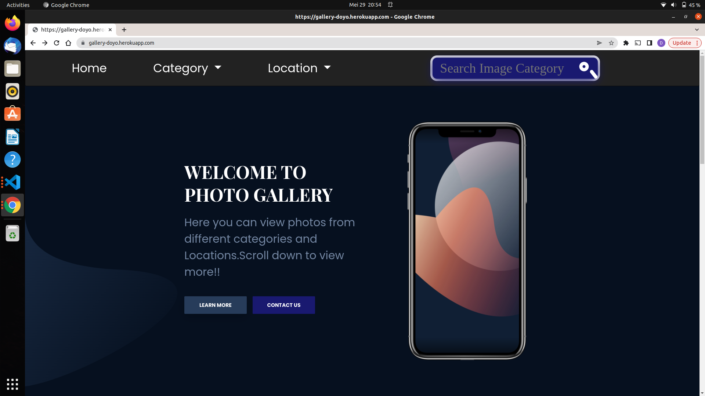
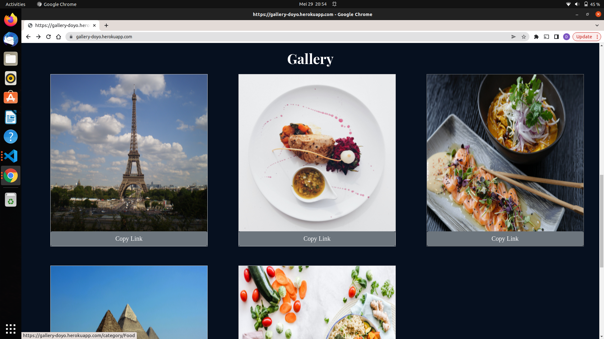

# My Photo Gallery
## Author
Doyo Abdikadir Doyo

## Description
Photo Gallery is a web application that allows its users to view images from different categories and interact with them.

## Screenshots
Landing Page


Gallery


## Setup and installations
* Clone Project to your machine
* Activate a virtual environment on terminal: source virtual/bin/activate
* Install all the requirements found in requirements.txt file.
* On your terminal run python3 manage.py runserver
* Access the live site using the local host provided


#### The application requires the following installations to operate 
* python3.9
* virtual environment
* pip

#### Cloning

* Open Terminal {Ctrl+Alt+T}

* git clone ```https://github.com/Doyo54/Django-photo-gallery```

* Create and activate the virtual environment
    ```python3 -m virtualenv virtual```
    ```source virtual/bin/activate```

* Move to the folder and install requirements
    ```pip install -r requirements.txt```

## Setting up environment variables
Create a .env file and paste paste the following filling where appropriate:

* SECRET_KEY='Generate one that suits you'
* DEBUG=True
* DB_NAME='image'
* DB_USER='<your database name>'
* DB_PASSWORD='<password to your database>'
* DB_HOST='127.0.0.1'
* MODE='dev'
* ALLOWED_HOSTS='*'
* DISABLE_COLLECTSTATIC=1

## Make and run migrations
* python3 manage.py check
* python manage.py makemigrations photos
* python3 manage.py migrate

## Run the app
* Running the application
    ```python3 manage.py runserver```
* Testing the application
    ```python3 manage.py test```

## Technologies Used
* python3.9
* Django
* Javascript
* Postgresql
* Bootstrap
* HTML / CSS

## Known Bugs
* There are no known bugs

## License Information
 Copyright (c) 2022 **Doyo Abdikadir Doyo**